# Agentic AI-Powered Sales Order Assistant with Microsoft Teams & Slack Integration

An Agentic AI-powered solution that enables customers to gain real-time insights about sales orders and logistics through natural language queries across SAP, non-SAP systems and company knowledge bases with tightly integrated MS Teams and Slack Interface for easy access

##  Table of Contents

[[_TOC_]]

## Overview

SAP systems are enterprise backbones managing critical processes and data. Organizations need better ways to leverage this data for insights and decision-making. Generative AI's NLP enables natural language interaction with SAP systems, making data accessible without technical expertise. This integration combines structured SAP data with unstructured sources, enabling better forecasting and personalized experiences. AWS and SAP support customers' GenAI adoption through AI services, infrastructure, and implementation resources that integrate with their broader cloud ecosystem

I will begin by developing the business logic necessary for extracting data from the SAP system. I will create two [AWS Lambda](https://aws.amazon.com/lambda/) functions that will execute the business logic, supported by various AWS services including [Bedrock Knowledge](https://aws.amazon.com/bedrock/knowledge-bases/) Bases and [AWS Secrets Manager](https://aws.amazon.com/secrets-manager/).  
In the next phase, I will focus on creating business logic to process data from an additional data source, implementing another lambda function specifically designed to extract data from [Amazon DynamoDB](https://aws.amazon.com/dynamodb/), which contains logistics information.To enhance the system's capabilities, I will establish a knowledge base that will serve as a third data source, facilitating general user queries. Following this, I will implement a [Amazon Bedrock Agents](https://aws.amazon.com/bedrock/agents/) responsible for orchestrating the flow between these different data sources based on user queries.  
In the final stage, I will create an user interface using Streamlit, while also providing an alternative integration option with Slack for enhanced accessibility.

### High Level Architecture

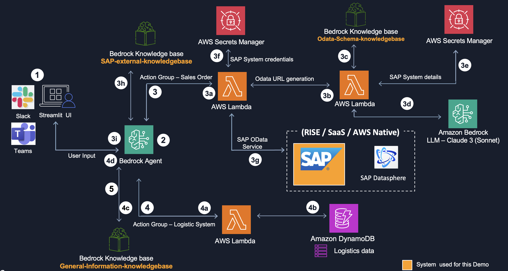

Flow:
1. Users can access the application through Streamlit UI or Slack
2. Based on user inputs, Bedrock agent orchestrates interactions between different applications [SAP, Non-SAP Lgoistics] 
   and data sources or Bedrock knowledge bases.
3. If the user query is related to SAP Sales order, Bedrock Agent invokes Sales Order action group.  
    3a. Lambda executes the business logic for action group SAP Sales Order.\
    3b. Lambda executes the business logic to generate OData URL dynamically based on the user query.\
    3c. Knowledge  base to store schema details helps LLM to generate Odata URL with the correct attributes.\
    3d. Based on the user query and schema details, LLM is invoked through Bedrock to generate the OData URL.\
   3e,3f. AWS Secrets Manager to store system connection details and SAP system login credentials  for the service user.\
    3g. Using the OData URL generated in step 3b and system credentials in step 3f, business data is fetched from 
        SAPsystem with the help of OData data protocol.\
    3h. Knowledge base is invoked to supplement information from SAP system if needed.\
    3i. Finally, the Bedrock agent combines all the information and responds to the user query.\

4. If the user query is related to shipping information, Bedrock agent invokes Non-SAP Logistic System action group.  
    4a. Lambda executes the business logic for action group Logistics System.\
    4b. Dynamo DB that holds Logistic information about Sales Order.\
    4c. Bedrock Knowledge base to supplement information from Logistics  system.\
    4d. Finally, the Bedrock agent combines all the information and responds to the user query.
    
5. If the user queries general information from organization’s data, Bedrock Agent invokes this knowledge base

## Prerequisites 
- An AWS account with appropriate IAM permission to work with [Amazon S3](https://aws.amazon.com/s3/), AWS Lambda,    
     Amazon Bedrock Agents, Amazon Bedrock Knowledge Bases, [Amazon Bedrock LLM(Claude)](https://aws.amazon.com/bedrock/claude/), AWS Secrets Manager, Amazon DynamoDB. If you are not familiar with these services, it’s highly recommend reviewing them before proceeding further.
- An SAP system serving as data source for SAP Sales Order.
- I have used a standard OData service, SAP Sales Order Service: API_SALES_ORDER_SRV and Entity Set: A_SalesOrder,
     for this demo however you may use any OData service of your choice based on your use case. I have exposed the OData over internet but based on your scenarios where your SAP system is located you may or may not expose it to internet.However, we recommend to setup a private connectivity for better performance and security posture.
     For more information, see [How to Enable OData Services in SAP S/4HANA](https://help.sap.com/docs/advanced-financial-closing/administration/how-to-enable-odata-services-in-sap-s4hana) and [Connecting to RISE from your AWS account](https://docs.aws.amazon.com/sap/latest/general/rise-accounts.html).
- Slack account for slack integration[optional] 


## Deployment Steps

**Step 1 – Create business logic to fetch data from an SAP system**

I. I will start with creating secrets in the AWS secrets manager to store S4 systems credentials and system connection details.

Choose secret type as **Other type of secret** and then add the below details under **Key/value pairs.** Put the secrets value as applicable to your environment.

| **Secret key** | **Secret value** |
| --- | --- |
| S4_host_details | https://<hostname>:<port> |
| S4_username | xxxx |
| S4_password | xxxx |

For more information, see [Create an AWS Secrets Manager secret](https://docs.aws.amazon.com/secretsmanager/latest/userguide/create_secret.html).


II. As a second step, I will create two Bedrock Knowledge Bases to complement and supplement SAP data as needed.

- `Odata-Schema-knowledgebase` I will use this knowledge base to provide schema details to the LLM, so that the model has enough knowledge about the attributes to be used while creating the Odata URL based on the user query.

- `SAP-external-knowledgebase` I will use this knowledgebase to provide supplementary details to SAP and non-SAP data.

I have considered the following inputs while creating the two knowledge bases, while keeping all other settings at their default values.

* **Provide Knowledge Base details**
     * Knowledge Base name: Choose a name for each knowledge bases with a user-friendly description. I have used `Odata-Schema-knowledgebase` and `SAP-external-knowledgebase`.
     * IAM permissions: Choose `Create and use a new service role`

* **Configure data source**
    * Data source: Choose `Amazon S3`
    * Data source name: Choose a name for each data source.
    * S3 URI: Create two S3 buckets, one for each knowledge bases. Upload the `Sales_Order_Schema.json` file for `Odata-Schema-knowledgebase` and `Shipping_Policy.pdf` for `SAP-external-knowledgebase` from GitHub repo to corresponding S3 buckets and provide the S3 URI.

* **Configure data storage and processing**
    * Embeddings model: `Amazon Titan Text Embeddings V2`
    * Vector Database: Vector creation method as `Quick create a new vector store` and vector store as `Amazon OpenSearch Serverless.`

    For more information, see [Create a knowledge base](https://docs.aws.amazon.com/bedrock/latest/userguide/knowledge-base-create.html)

Here's what my final entry looks like:
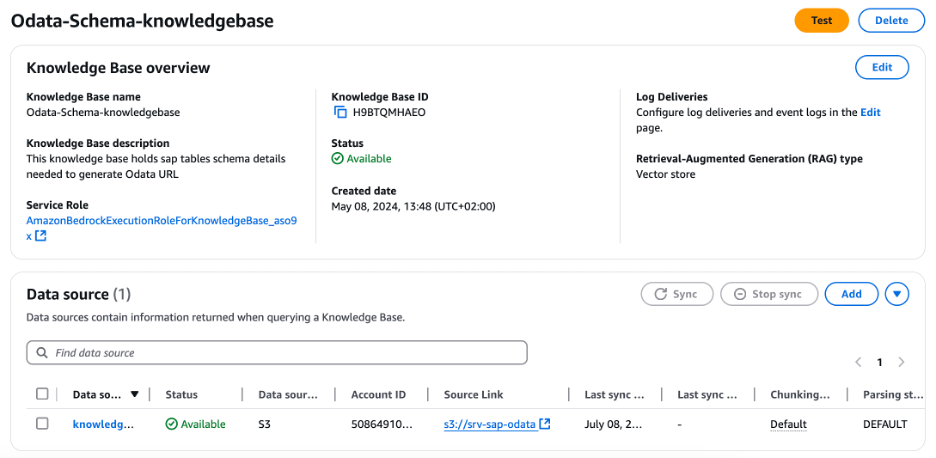
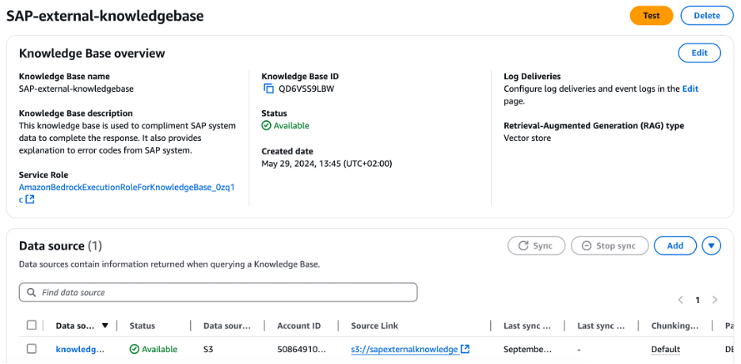

III. Now I will create will two lambda functions to extract data from SAP systems based on user query.

- `SAP-Odata-URL-Generation` -This lambda executes the business logic to generate Odata URL based on the user queries with the help of LLM supported by schema details from the knowledge base and host details from AWS secrets manager.
- `SAP-Sales-Order-Query` - This Lambda function executes the core business logic for retrieving data from the SAP system. It utilizes the OData URL provided by the SAP-Odata-URL-Generation lambda and securely accesses system credentials stored in AWS Secrets Manager. The function then processes the fetched data, leveraging LLM through bedrock, and finally presents the structured information to the Bedrock agent for further use.

I have considered the below inputs while creating the functions, while keeping all other settings at their default values.
* Choose **Author from scratch**
* Function name: Choose a name for each function with a user-friendly description. I have chosen `SAP-Odata-URL-Generation` and `SAP-Sales-Order-Query`.
* Runtime: **Python 3.13**
* Architecture: **x86_64**
* Code: Copy the code [SAP-Odata-URL-Generation.py](<SAP Sales Order/SAP-Odata-URL-Generation.py>) for function `SAP-Odata-URL-Generation` and [SAP-Sales-Order-Query.py](<SAP Sales Order/SAP-Sales-Order-Query.py>) for `SAP-Sales-Order-Query`.
* Configuration: **Memory : 1024MB** , **Timeout : 15min**
* Layers: Add the layer[requests-layer.zip](<SAP Sales Order/requests-layer.zip>) to add `requests` module to the lambda function. 

For more information, see [Building Lambda functions with Python](https://docs.aws.amazon.com/lambda/latest/dg/lambda-python.html) and [Working with layers for Python Lambda functions](https://docs.aws.amazon.com/lambda/latest/dg/python-layers.html)


**Step 2 – Create the business logic to fetch data from a non-SAP system**
    
I.	I will start with creating a DynamoDB table, with the below inputs. 
    Table name: logistics. 
    Partition key: order_id. 
    Use the `Items.json` file to create item in the DynamoDB table.
    For more information, see [Creating Amazon DynamoDB Table Items from a JSON File](https://docs.aws.amazon.com/sdk-for-go/v1/developer-guide/dynamo-example-load-table-items-from-json.html)

II.	I will now create a lambda function to extract data from the DynamoDB table based on user query.

*   Choose **Author from scratch**
*   Function name: Choose a name for the function with a user-friendly description. I have chosen `Logistics-System`.
*   Runtime: **Python 3.13**
*   Architecture:  **x86_64**
*   Configuration: **Memory : 1024MB** , **Timeout : 15min**
*   Code: Copy the code from [Logistics-System.py](<SAP Logistics/Logistics-System.py>)

**Step 3 – Create a knowledgebase for general queries**.  
    Now I will create a third knowledge base.
`General-information-knowledgebase`: I will use this knowledge base to provide guidance on business processes, though it can be adapted to address other relevant subject areas as needed.
I assume, now you already know how to create a knowledge base. I have considered the below inputs while creating the knowledge bases, keeping the rest as default.
- Provide Knowledge Base details
    * Knowledge Base name: Choose a name for each knowledge bases, I have used `General-information-knowledgebase` with a user-friendly description.
    * IAM permissions: Choose `Create and use a new service role`
- Configure data source
    * Data source: Choose **Amazon S3**
    * Data source name: Choose a name for the data source as per your choice.
    * S3 URI: Create a S3 buckets, upload the `How to create SAP Sales Order pdf` and provide the corresponding S3 URI.
- Configure data storage and processing
    * Embeddings model: **Amazon Titan Text Embeddings V2**
    * Vector Database: Vector creation method as `Quick create a new vector store` and vector store as `Amazon OpenSearch Serverless`.

Here's what my final entry looks like:

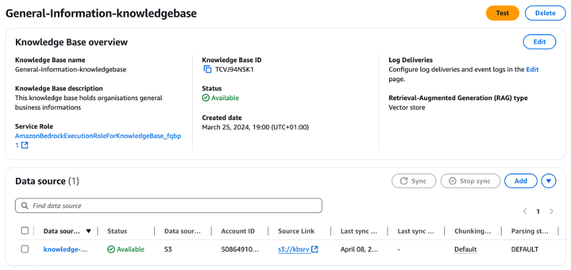


**Step 4 – Create Bedrock Agent**
In this step I will create a bedrock agent to help us orchestrate between different data sources we created in previous steps to respond to user queries.

I have considered the below inputs while creating the bedrock agent, while keeping all other settings at their default values.
- Agent details:
    * Agent name: Choose a name for the agent and a user-friendly description. I have named it Business-Query-System 
    * Agent resource role: Choose Create and use a new service role
    * Select model: Choose Claude 3 Sonnet v1. You may choose a different LLM, but you need to modify the prompts accordingly to have the desired response.
    * Instructions for the Agent: Give precise, step-by-step directions that clearly explain what you want the Agent to do.  
    `You are an AI assistant helping users in querying SAP sales data directly from SAP system and shipping details from logistic system. You also help users with general queries about business process from the company knowledge base`
    * Additional settings:  User input choose Enabled

- Action groups : Action groups define the tasks that agents should be able to help users fulfil.
    * Action Group: `SAP-Sales-Order`. I will use this action group to process any queries related to SAP Sales order.  
        Action group name: Choose a name for the action group and put a user-friendly description. I have named it `SAP-Sales-Order`.  
        Action group type: Define with function details.   
        Action group invocation: Select an existing Lambda function and select the lambda function we created in Step 1, `SAP-Sales-Order-Query`. 
        Action group function1 name: `SalesOrder` and provide a description for the function.  
    * Action Group: `Logistics-System`. I will use this action group to process any queries related to Logistics information for sales order.  
        Action group name: Choose a name for the action group and put a user-friendly description. I have named it `Logistics-System`.  
        Action group type: **Define with API schemas**.  
        Action group invocation: **Select an existing Lambda function** and select the lambda function we created in Step 2, `Logistics-System`.    
        Action group schema: Select an **existing API schema**.

- S3 Url: Create a S3 bucket and upload the file `logistics.json` from GitHub to S3 bucket and provide the S3 Uri of the bucket.

- Memory : Choose **Enabled** with Memory duration to 2 days and Maximum no of recent sessions to 20.
- Knowledge Bases : Add the knowledge bases created before
    * Select Knowledge Base: `SAP-external-knowledgebase`. 
    Knowledge Base instructions for Agent: Use this knowledge base when you need some information outside of SAP system and combine it with SAP system data to complete the response
    * Select Knowledge Base: `General-Information-knowledgebase`. 
    Knowledge Base instructions for Agent: Use this knowledgebase to answer generic business question from the user which is not available from SAP system.

- Orchestration strategy details – **Default orchestration**. Bedrock agents provide default prompt templates, but these can be tailored to meet specific requirements. I will customize the below prompt templates to align with our specific use case requirements.

    * Pre-processing: Choose **Override pre-processing template defaults**. Add the below section to the prompt template.  
`-Category F: Questions that can be answered or assisted by our function calling agent using the functions it has been provided and arguments from within conversation history or relevant arguments it can gather using the askuser function AND also need external data from the knowledge base to complete the response.Combine data from the SAP or Logistic system and the external knowledge base to prepare the final answer`. 
    * Orchestration: Choose **Override orchestration template defaults**. Add the below to the prompt template
Add the below text under the corresponding sections.  
**`$knowledge_base_guideline$`**.  
 `-If any data is not updated in the Logistic system like order shipping date, then check the knowledge base named 'SAP-external-knowledgebase' to look for the estimated delivery timeline as per the shipping category. Then consider that timeline and add the timeline to the date of 'Order Received' and share the estimated the shipping date with the user.`. 
`-If the SAP system throws any error due to unavailability of the requested data, check the knowledge base named 'SAP-external-knowledgebase' to look for the explanation of the ERROR CODE. Respond to the user with the explanation of the error code ONLY.`. 
**`$tools_guidelines$`** [This section doesn’t exist, we need to create it].  
`-Invoke tool 'SAP-Sales-Order' ONLY for any questions related to sales order`. 
`-Invoke tool 'Logistics-System' ONLY for any shipping details for the sales order`. 
`-Do NOT invoke both tools 'SAP-Sales-Order' and 'Logistics-System' unless user requested for both the information.`.  
**`$multiple_tools_guidelines$`** [This section doesn’t exist, we need to create it].  
`-If user asks question which needs to invoke more than one tool. Invoke the tools one by one. Collect the response from both the tools and then combine them before responding to the users.`. 
`For example, if user requests for both Sales order and Logistic information. First fetch the Sales Order details with Sales Order tool. Then fetch logistic details from Logistic tool. Finally combine both responses into one when responding to the user.`

Once we have entered all the details I will **Save** and then choose **Prepare** to update the latest changes. To navigate to the agent overview page choose **Save and exit**.

Finally, create an **Aliases** to have a specific snapshot, or version of the agent to be used in the application.  
Choose **Create**, provide a **Alias name** with a user fiendly **Description**. 
Choose **Create a new version and associate it to this alias** for version with throughput as default to **On-demand**.

For more information, see [Create and configure agent manually](https://docs.aws.amazon.com/bedrock/latest/userguide/agents-create.html)

Here's what my final entry looks like:

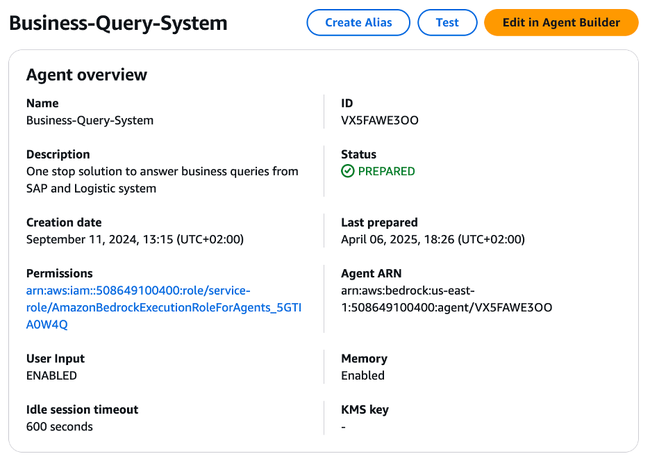
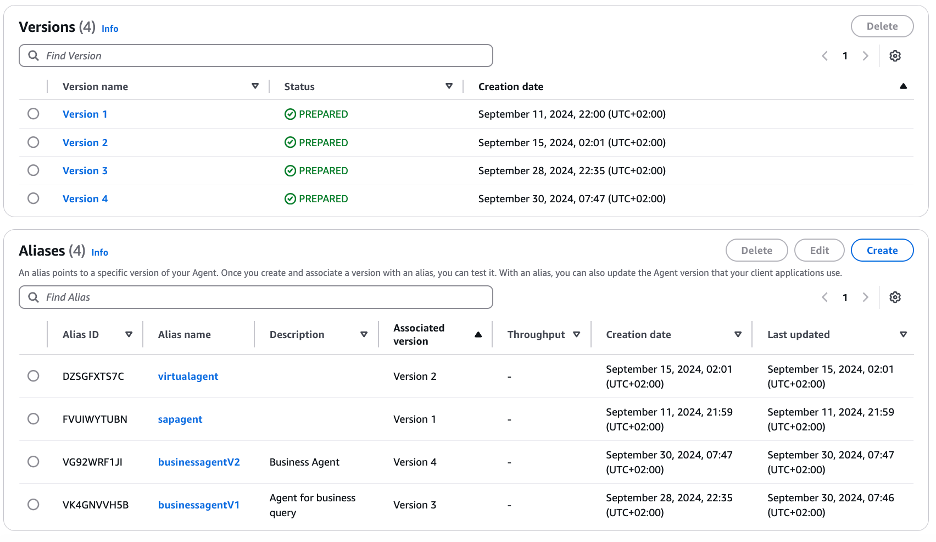

As you see, I have created multiple aliases and versions of my agent, allowing me to select any alias to integrate a specific snapshot or version into my application

Now I need to adjust the IAM roles for the Lambda function so that the bedrock agent could invoke them.
Follow the steps at [Using resource-based policies for Lambda](https://docs.aws.amazon.com/lambda/latest/dg/access-control-resource-based.html) and attach the following resource-based policy to a Lambda function to allow Amazon Bedrock to access the Lambda function for your agent's action groups, replacing the *${values}* as necessary.

```python
{
    "Version": "2012-10-17",
    "Statement": [
        {
            "Sid": "AccessLambdaFunction",
            "Effect": "Allow",
            "Principal": {
                "Service": "bedrock.amazonaws.com"
            },
            "Action": "lambda:InvokeFunction",
            "Resource":  "arn:aws:lambda:${region}:${account-id}:function:function-name",
            "Condition": {
                "StringEquals": {
                    "AWS:SourceAccount": "${account-id}"
                },
                "ArnLike": {
                    "AWS:SourceArn": "arn:aws:bedrock:${region}:${account-id}:agent/${agent-id}"
                }
            }
        }
    ]
}
```

Here’s what my policy looks like.  

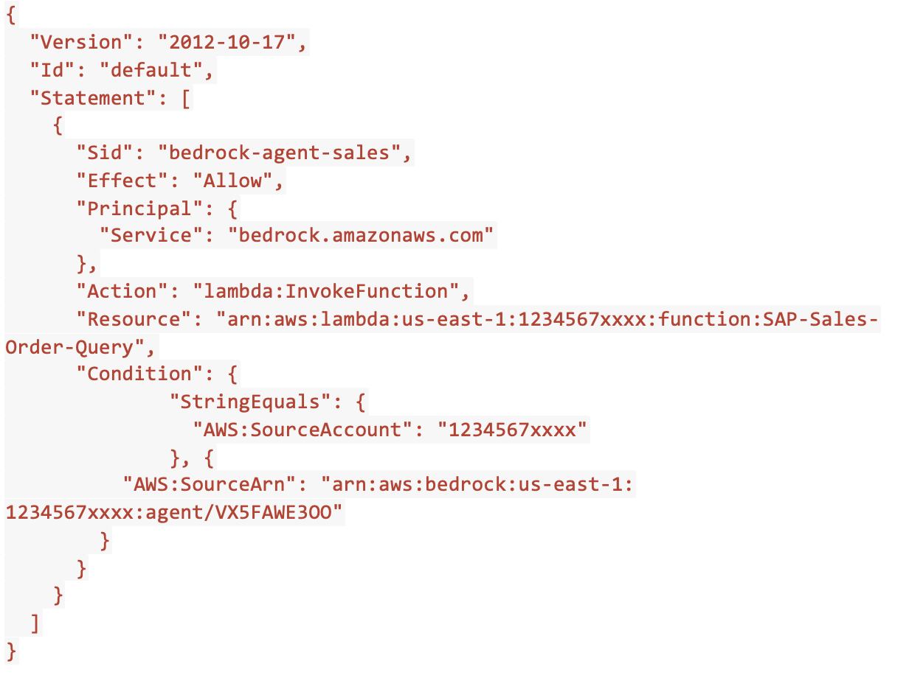

**Step 5 – Create user interface with Microsoft Teams, Slack and Streamlit**. 
This step involves developing an user interface that allows users to interact with the Bedrock agent. 

- Microsoft Teams – This integration requires both Microsoft Teams access with appropriate permissions and access to Amazon Q Developer (previously known as AWS Chatbot) service.

    Step1: Configure App access:
    Microsoft Teams is installed and approved by your organization administrator. 

    Step2: Configure a Teams channel:
    Create a MS Teams standard channel or use an existing one and add Amazon Q Developer to the channel.[Note: We need Standard channel as[Microsoft Teams doesn't currently support Amazon Q Developer in private channels](https://learn.microsoft.com/en-us/microsoftteams/private-channels#private-channel-limitations)]. 
    a.	In Microsoft Teams, find your team name and choose, then choose **Manage team**.  
    b.	Choose **Apps**, then choose **More apps**.  
    c.	Enter **Amazon Q Developer** in the search bar to find Amazon Q Developer.  
    d.	Select the bot.  
    e.	Choose **Add to a team** and complete the prompt. 
    
    Step3: Configure Amazon Q Developer for Teams client.    
    This step provides **Amazon Q Developer in chat Applications** access to your MS Teams channel.  
    Open the **Amazon Q Developer in chat applications** in AWS console.   
    Under **Configure a chat client**, choose **Microsoft Teams**, Copy and paste your Microsoft Teams channel URL which we created in previous step then choose **Configure**. [You'll be redirected to Teams's authorization page to request permission for Amazon Q Developer to access your information].  
    On the Microsoft Teams authorization page, choose **Accept**.  
    On the left side, now you should see your Teams Channel listed under Microsoft Teams. .
    
    Next I will associate a MS Teams channel to my configuration.  
    On the **Teams details** page in the Amazon Q Developer console, choose **Configure new channel**. I have the below inputs for my configuration, keeping rest as default.  
    * **Configuration details**  
    *Configuration name*: Choose a name for your configuration. I named it `aws-sap-demos-team`. 
    * **Microsoft Teams channel**.   
    *Channel UR*L: Copy and paste your Microsoft Teams channel URL which we created in step2.  
    * **Permissions**.  
    *Role settings*: Choose **Channel role**.   
    *Channel role*: Choose **Create an IAM role using a template**.   
    *Role name*: Choose a name of your choice. I have named it `awschatbot-sap-genai-teams-role`.   
    *Policy templates*: Amazon Q Developer access permissions. 
    *Channel guardrail policies[Policy name]*: `AWSLambdaBasicExecutionRole` , `AmazonQDeveloperAccess`. You may adjust the IAM policies as per your requirement but it is always recommended to follow the best practice of *least-privilege permissions*.
    
    Step4: Now we will connect an agent to the chat channel.   

    To add Amazon Bedrock agent to your chat channel, `enter @Amazon Q connector add connector_name arn:aws:bedrock:aws-region:AWSAccountID:agent/AgentID AliasID`. Choose a connector name of your choice.   
    My entry looks like this.   
    `@Amazon Q connector add order_assistant arn:aws:bedrock:us-east-1:xxxxxxx:agent/VX5FAWE3OO VG92WRF1JI`

    For more information, see [Tutorial: Get started with Microsoft Teams](https://docs.aws.amazon.com/chatbot/latest/adminguide/teams-setup.html)

    The Teams interface looks like this

    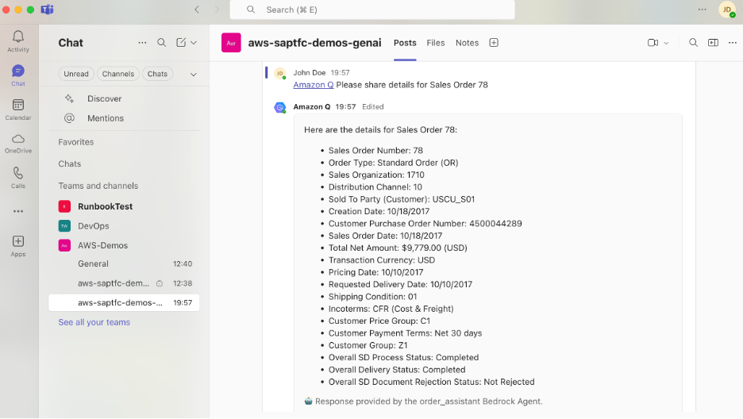

- Slack – This integration requires both Slack access with appropriate permissions and access to Amazon Q Developer (previously known as AWS Chatbot) service.

    Step1: Configure App access:  
    Workspace administrators need to approve the use of the Amazon Q Developer app within the workspace.   

    Step2: Configure a Slack channel:  
    Create a slack channel or use an existing one and add Amazon Q Developer to the Slack channel.
    In your Slack channel, enter `/invite @Amazon Q` and choose **Invite Them**

    Step3: Configure Amazon Q Developer for Slack client. 
    This step provides **Amazon Q Developer in chat Applications** access to your Slack workspace.  
    Open the **Amazon Q Developer in chat applications** in AWS console. Under Configure a chat client, choose Slack, then choose Configure. *[You'll be redirected to Slack's authorization page to request permission for Amazon Q Developer to access your information]*.   
    Choose the Slack workspace that you want to use with Amazon Q Developer and Choose **Allow**.   
    On the left side, now you should see your Slack workspace listed under Slack.  

    Next I will associate a channel with my configuration.  
    On the **Workspace details** page in the Amazon Q Developer console, choose **Configure new channel**. I have the below inputs for my configuration.    
    * Configuration details:   
            *Configuration name*: Choose a name for your configuration. I named it `sap-genai-slack-chatbot`. 
    * Amazon Internal Preferences. 
            *Account Classification*: Choose **Non-Production**. 
    * Slack channel. 
            *Channel ID*: Provide the channel ID of the slack channel you configured in step2.
    * Permissions.  
            *Role settings*: Choose **Channel role**. 
            Channel role: Choose **Use an existing IAM role**. 
            *Role name*: Choose a name of your choice. I have named it `aws-sap-genai-chatbot-role`. 
            *Policy templates*: N/A. 
            *Channel guardrail policies[Policy name]*: `AWSLambdaBasicExecutionRole` , `AmazonQDeveloperAccess`. You may adjust the IAM policies as per your requirement but it is always recommended to follow the best practice of least-privilege permissions.

    Step4: Now we will connect an agent to the chat channel.   

    To add Amazon Bedrock agent to your chat channel, `enter @Amazon Q connector add connector_name arn:aws:bedrock:aws-region:AWSAccountID:agent/AgentID AliasID`. Choose a connector name of your choice.   
    My entry looks like this.   
    `@Amazon Q connector add order_assistant arn:aws:bedrock:us-east-1:xxxxxxx:agent/VX5FAWE3OO VG92WRF1JI`

For more information, see [Tutorial: Get started with Slack](https://docs.aws.amazon.com/chatbot/latest/adminguide/slack-setup.html#getting-started-prerequisites-slack)

The Slack interface looks like this

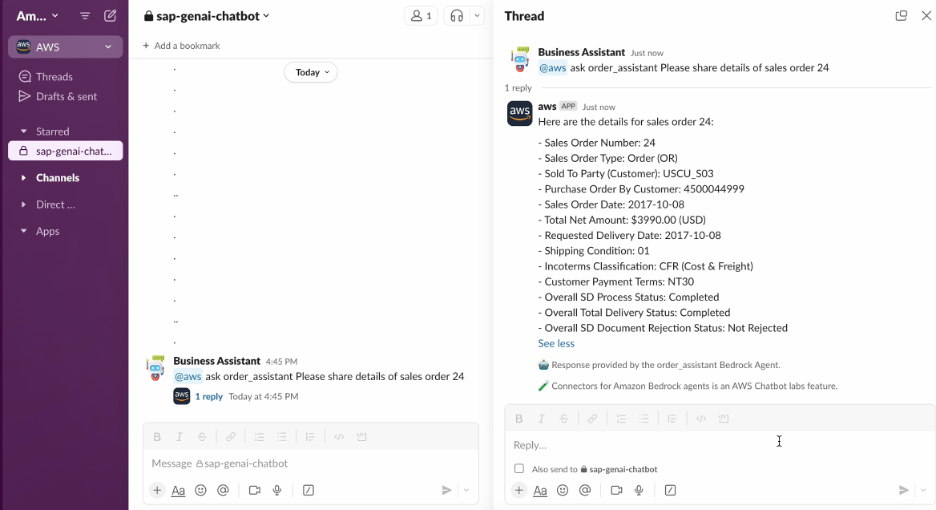

- Streamlit - Streamlit is an open-source Python framework generally used to build interactive web apps for python scripts. I have followed the below steps to host the application on an amazon EC2 instance.
    * Spin up a EC2 instance, I have considered an Amazon Linux t2.micro instance.
    * Setup the EC2 instance with needed security group allowing HTTP/HTTPS traffic (port 80/443/8501 or any other port you have chosen to use)
    * Prepare the environment as below

        Install Required Packages.  
        `$sudo apt update`  
        `$sudo apt-get install python3-venv`.  

        Set Up a Virtual Environment. 
        `$mkdir streamlit-demo`.   
        `$cd streamlit-demo`.  
        `$python3 -m venv venv`.   
        `$source venv/bin/activate`.   

        Install Streamlit.  
        `$pip install streamlit`

    * Create a file named streamlit-app.py using Vi/Vim/nano editor and copy the code in streamlit-app.py from GitHub.

    * Run the streamlit app with the below command.   
    `$streamlit run streamlit-app.py`

    * Run the streamlit app in background with the below command.   
    `$nohup streamlit run streamlit-app.py &`

    * Streamlit assigns the available port from 8501 in increments of 1. If you want streamlit to consider a specific port, you may use the below command.  
    `$streamlit run streamlit-app.py --server.port XXXX`

After I ran the above commands, I could see the URL to open the Streamlit application in my browser, as shown below.  

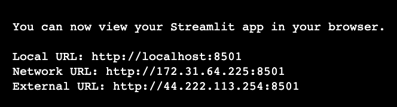


The Streamlit application looks like this

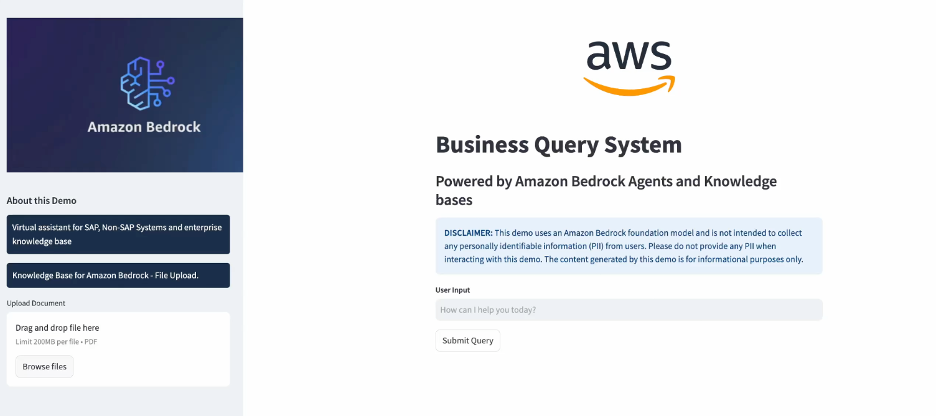


## Cost

Operating Large Language Models (LLMs) involves substantial infrastructure, development, and maintenance costs. However, AWS services like AWS Bedrock can significantly reduce expenses through simplified infrastructure management, streamlined development processes, flexible pricing models, and various cost optimization options for accessing the LLM's of your choice.

| **AWS Service - US East (N. Virginia)** | **Usage** | **Estimates [ running for an hr.]** |
| --- | --- | --- |
| Bedrock – Foundation Model LLM Inference[Claude 3.5 Sonnet] | 100K Input, 200K Output [Tokens] | $3.3  |
| Bedrock – Embedding Model Inference[Amazon Titan Text Embeddings v2] | 100 documents, each avg. 500 words | $0.10 |
| OpenSearch Compute Unit (OCU) - Indexing | 2 OCU[min. 2 OCU] | $0.48 |
| OpenSearch Compute Unit (OCU) - Search and Query | 2 OCU[min. 2 OCU] | $0.48 |
| OpenSearch Managed Storage | 10GB | $0.24 |
| EC2 Instance[Streamlit App] | t2.micro | $0.0116 |
| Lambda, Secrets Manager, DynamoDB |  | $0.2[Ballpark] |
     Estimated cost for using application for an hr. - $4.8116


## Demo

 1. [Short demo with Streamlit and Slack](Assets/Demo_Streamlit_Slack.mp4)
 
 2. [Short demo with MS Teams](Assets/Demo_Teams.mov)


## Conclusion
This blog post demonstrates how to create an intelligent virtual assistant that seamlessly interacts with both SAP and non-SAP systems using AWS services, with a focus on Amazon Bedrock. The solution integrates SAP systems for sales order data, non-SAP systems for logistics information, and knowledge bases for supplementary details, all accessible through multiple user interfaces including Streamlit, Microsoft Teams, and Slack. By leveraging a suite of AWS services like Lambda, Bedrock, Secrets Manager, and DynamoDB, the implementation enables natural language interaction with complex enterprise systems, providing unified access to diverse data sources while maintaining robust security. The serverless architecture and pay-as-you-go pricing model make this an accessible and cost-effective solution for organizations looking to enhance their data access capabilities through conversational AI interfaces. The blog post provides a detailed, step-by-step guide to implementing this solution, paving the way for enterprises to leverage generative AI in their SAP and non-SAP environments

Watch for my next post, where I'll walk you through implementing this solution using SAP BTP services.

Visit the [AWS for SAP](https://aws.amazon.com/sap/) page to learn why thousands of customers trust AWS to migrate and innovate with SAP.
